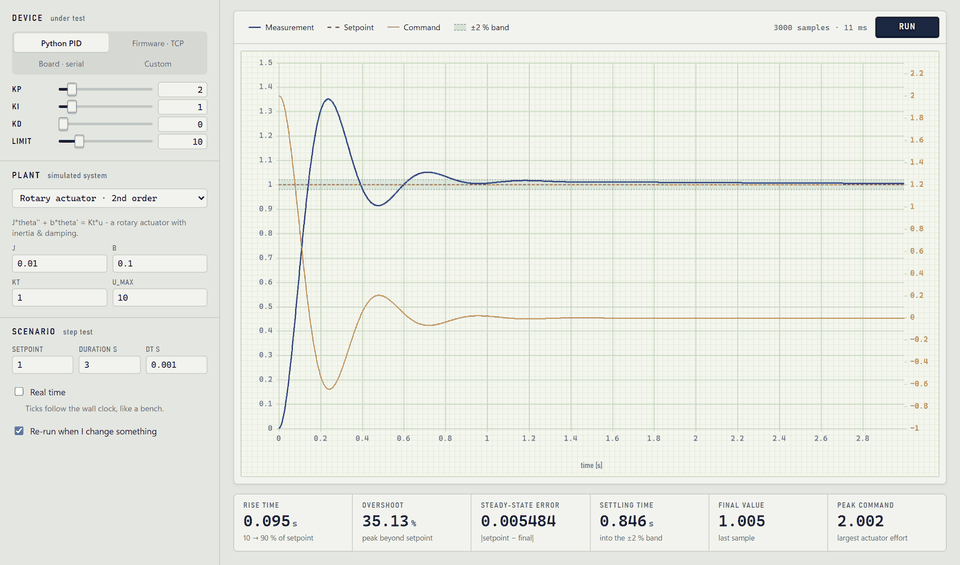
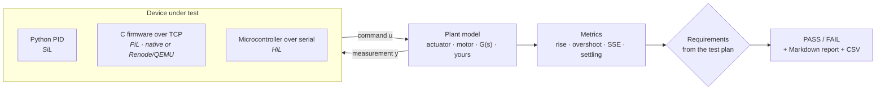
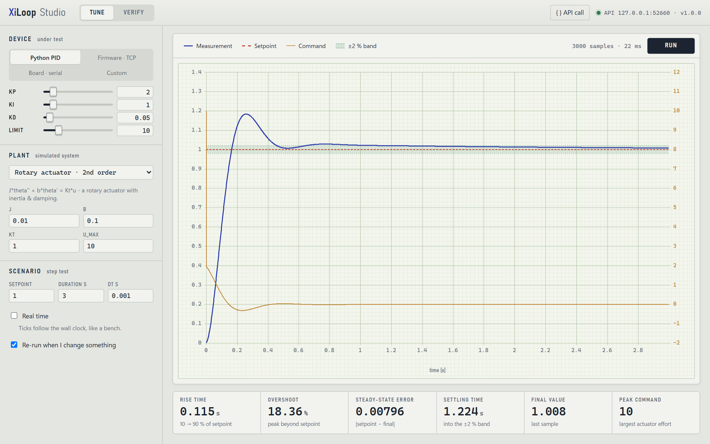
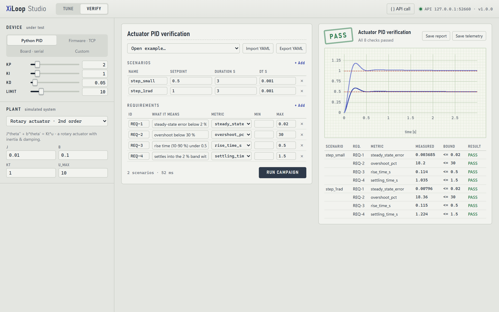
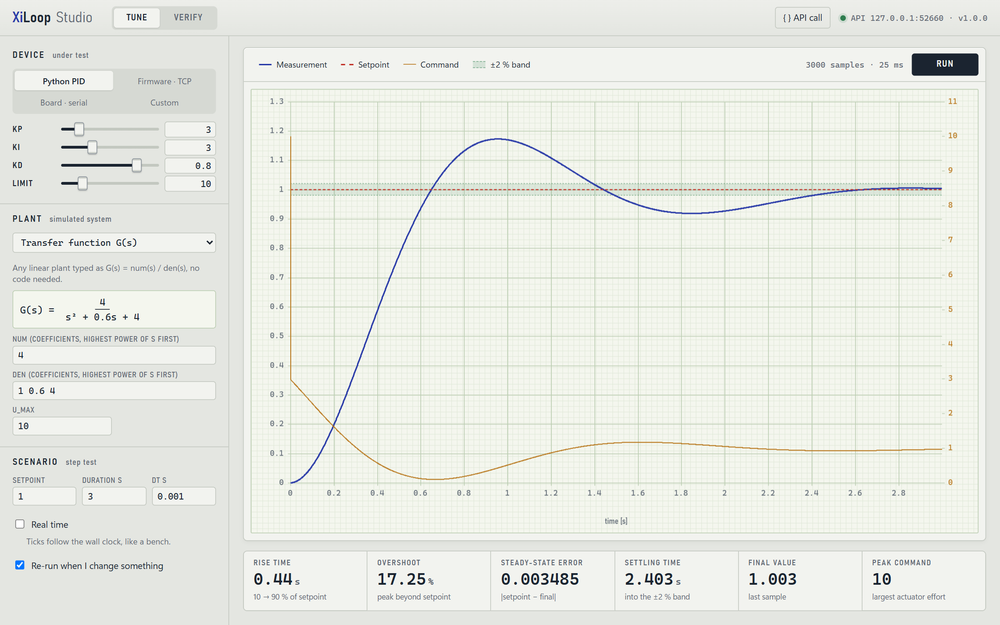
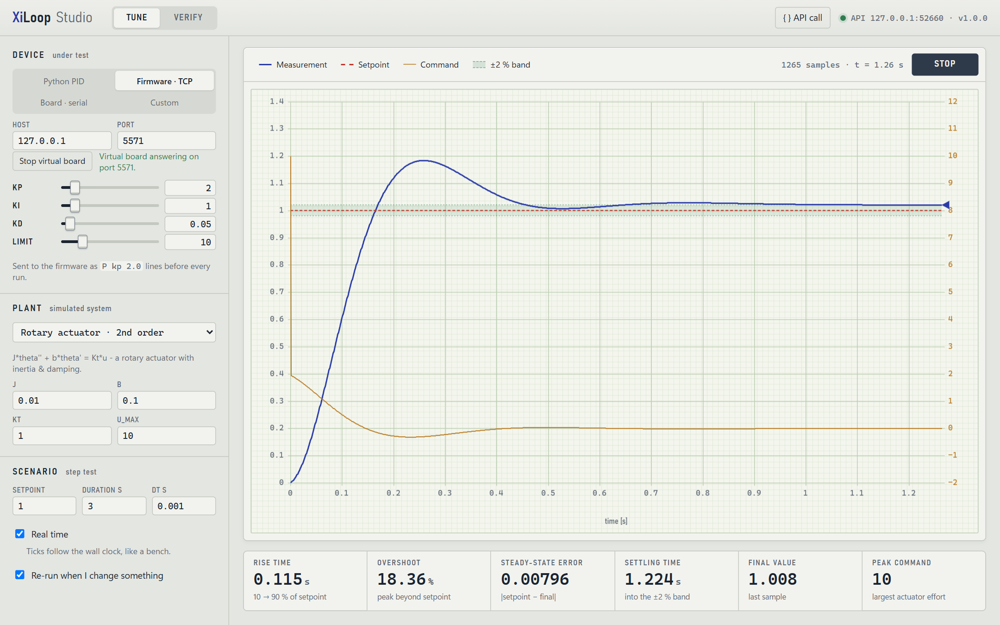
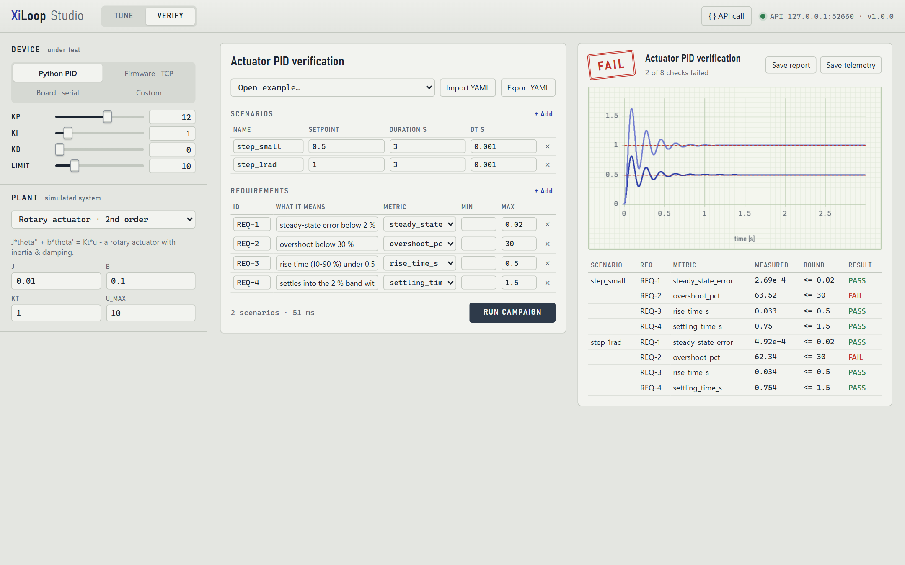
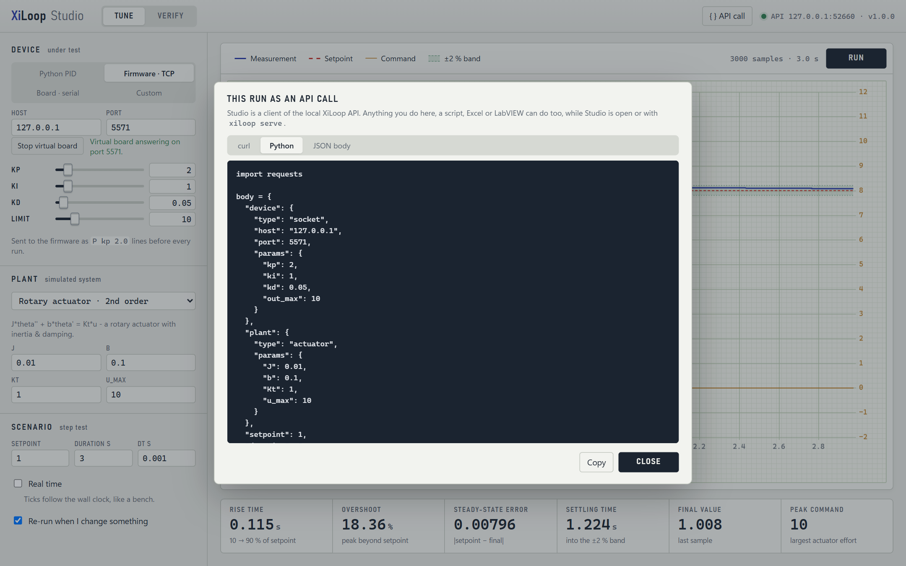
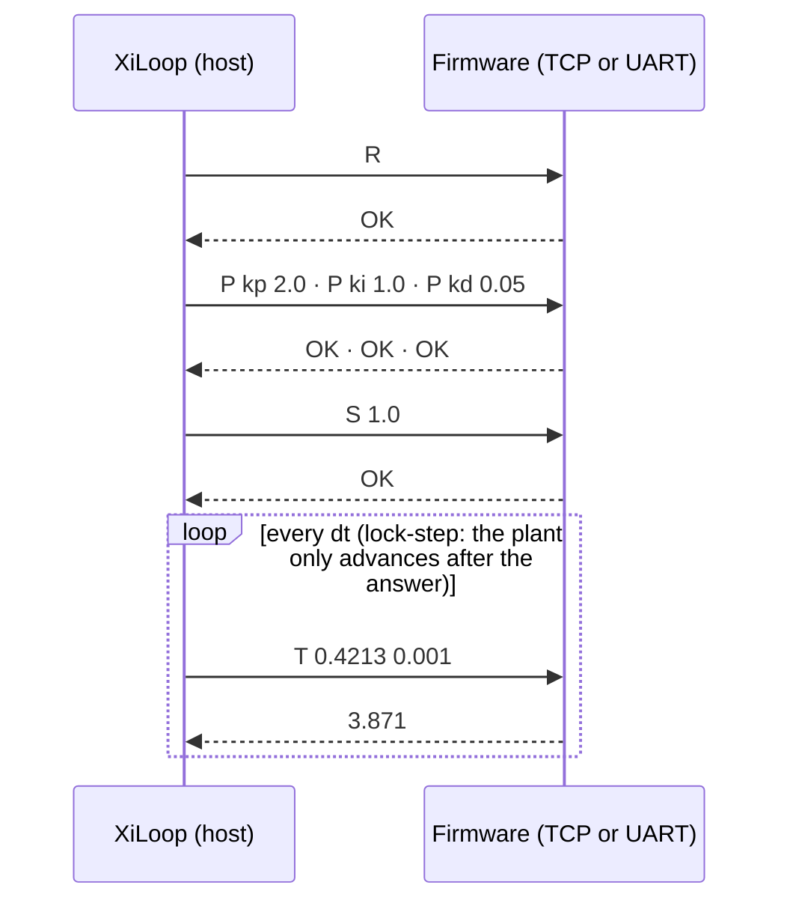

<div align="center">

# XiLoop

**X-in-the-Loop test bench: from a Python prototype to C firmware to a real board, with one test plan.**

*pytest for control loops, plus a desktop studio so you never have to write the test code yourself.*

[](https://github.com/Alifizz01/XiLoop/actions/workflows/ci.yml)




<sub>Drag a gain → the closed loop re-runs in ~25 ms → the response and every metric redraw.</sub>

</div>

---

## The problem

Every product with a control loop (a motor drive, a servo fin, a battery charger, a heater, a
drone) needs its controller verified before it touches real hardware. Today, outside big
companies, that verification usually looks like this:

| # | Problem | What it costs you | How XiLoop solves it |
|---|---|---|---|
| 1 | **Control bugs are found on the bench, last.** The first real test of a gain change is the real motor. | A wrong sign or an aggressive gain slams an actuator into its end stop, burns a driver stage or trips a battery. Bench time is slow and the failures are expensive or dangerous. | The controller runs against a **simulated plant** first, thousands of times in seconds. You break the model, not the hardware. |
| 2 | **Every stage has its own test harness.** The Python/MATLAB prototype, the C firmware and the board are each tested with different, hand-written scripts. | You can't prove that the firmware behaves like the prototype that was approved. "It worked in simulation" is a feeling, not evidence. | One **test plan** runs unchanged against Python (SiL), compiled C firmware (PiL) and a real board (HiL). Only the `device:` line changes. The demo C firmware matches the Python PID to four significant figures. |
| 3 | **Requirements live in a document, not in code.** "Overshoot < 30 %" sits in a PDF or spreadsheet and is checked by eye on a scope. | No regression testing. Next month a small gain tweak silently breaks settling time and nobody notices until integration. | Requirements are **executable checks** with a PASS/FAIL verdict, a Markdown report and an exit code. `xiloop run` in CI turns a broken requirement into a red build. |
| 4 | **Real HiL tooling is out of reach.** dSPACE, NI, Speedgoat and ECU-TEST rigs cost five to six figures. | Students, makers, start-ups and university labs have nothing between `print()` debugging and an industrial rig, so they rebuild the same plumbing every project. | Free and open source, runs on a laptop, and grows from pure software to a USB-serial board without changing tools. |
| 5 | **Tuning is a slow edit-flash-measure loop.** Change a gain, recompile, flash, run, eyeball the scope, repeat. | Hours per controller, and the "good" gains are whatever looked fine on the last try. | Drag a slider and the loop re-runs in about 25 ms with six live metrics. Firmware gains are sent over the wire (`P kp 2.0`), so even C firmware tunes without reflashing. |
| 6 | **Only programmers can run the tests.** Test engineers, students and reviewers have to read and edit Python to check a controller. | Verification bottlenecks on the one person who wrote the scripts. | **XiLoop Studio** does everything from a GUI: plants typed as G(s), requirements in a table, one-click campaigns. The **REST API** lets Excel, MATLAB, LabVIEW or a CI job do the same. |

**In one sentence:** XiLoop lets you prove, cheaply and repeatably, that a controller meets
its requirements, from the first Python sketch through the C firmware to the real board,
before anything expensive can break.

**Who it is for:** embedded and control engineers, students in control/mechatronics/EE labs,
makers building motor or power projects, and small teams that need HiL-style evidence without a
HiL budget.

**What it is not** (honest limits):
- not a certified tool (no ISO 26262 / DO-178C qualification). It produces evidence, not certification
- not hard real-time: real-time mode follows the PC's wall clock (millisecond-level jitter). Lock-step mode keeps the physics exact regardless
- single-input single-output loops today. MIMO is on the roadmap

---

## What it does

XiLoop wires the **device under test** (your controller) to a **plant model** (the simulated
system), runs the closed loop at a fixed step, and checks your **requirements**: rise time,
overshoot, steady-state error, settling time. You get a PASS/FAIL verdict and a report.



The same test plan runs against each rung of the ladder. Change one line in
`device:` and your Python prototype, your compiled C firmware and the real board all get
verified against **identical requirements**.

---

## XiLoop Studio: the no-code way

A native desktop app. Pick a device, pick or type a plant, drag the gains, write
requirements in a table, press **Run campaign**. No Python, no YAML.

| Tune: live response on chart-recorder paper | Verify: requirements → verdict |
|---|---|
|  |  |
| **Type any plant as a transfer function** | **Firmware in the loop, streamed in real time** |
|  |  |
| **A failing campaign shows you exactly what broke** | **Every run is also an API call: copy it** |
|  |  |

**What you can do without writing code**

- **Devices:** built-in PID · firmware over TCP · a board over serial (COM ports are listed for you) · a built-in *virtual board* so you can try PiL with nothing installed
- **Plants:** rotary actuator, first-order lag with dead time, DC motor, or **any linear plant typed as G(s) = num/den**, previewed as a real fraction
- **Tune:** sliders for kp / ki / kd / output limit. Every change re-runs the loop and updates six panel meters, with the ±2 % settling band drawn on the chart
- **Verify:** scenarios and requirements edited as tables · open the bundled examples · import/export YAML · PASS/FAIL stamp · save the Markdown report and the telemetry CSV
- **Real-time mode:** ticks follow the wall clock, and the trace is drawn live with a recorder pen, like a bench

---

## Quick start

```bash
git clone https://github.com/Alifizz01/XiLoop && cd XiLoop
pip install -e ".[all]"          # studio (pywebview) + serial (pyserial) + plots

xiloop studio                    # open the desktop app
```

On Windows you can also start it with no console window: run `xiloop-studio`, or create a desktop
shortcut to it. The app runs the API server in the background and closes it when you close the window.

**Your first verification in four clicks:** *Verify* → *Open example… → Actuator PID verification* → *Run campaign* → **PASS**.
Now drag **KP** up to 12 and **KD** to 0, run again, and watch REQ-2 (overshoot) fail.

---

## The ladder: SiL → PiL → HiL

All out-of-process devices speak one tiny line protocol, so one firmware works everywhere:

| Host → device | Device → host | Meaning |
|---|---|---|
| `R` | `OK` | reset controller state |
| `S <setpoint>` | `OK` | new target |
| `P <name> <value>` | `OK` / `ERR …` | set a tunable (`P kp 2.0`). Studio's sliders send these |
| `T <measurement> <dt>` | `<command>` | one control tick |



Lock-step means host timing jitter can never corrupt the physics: the loop is as
deterministic as your firmware.

### PiL: your C code, compiled for the PC

[`examples/firmware_pid/`](examples/firmware_pid) holds a portable C99 PID (`pid_core.c`: no I/O,
the whole protocol in one function) plus a host TCP shim:

```bash
# Windows (Developer Prompt)          # Linux / macOS
cl /O2 /D_CRT_SECURE_NO_WARNINGS host_main.c pid_core.c ws2_32.lib /Fe:pid_firmware.exe
                                      cc -O2 host_main.c pid_core.c -o pid_firmware
./pid_firmware                        # listens on 127.0.0.1:5555
xiloop run examples/firmware_pid/testplan.yaml
```

The C firmware (float32) and the Python PID produce the **same metrics to four significant
figures**: 18.36 % overshoot and 1.224 s settling on the 1 rad step. That is exactly what PiL is for.
6000 TCP round-trips take about 0.7 s.

**Renode / QEMU:** build `pid_core.c` for your MCU, then expose its UART as a socket and
point the same `socket` device at it:

```
(monitor) emulation CreateServerSocketTerminal 5555 "xiloop" false
(monitor) connector Connect sysbus.uart0 xiloop
```

### HiL: a real microcontroller

Flash [`arduino_pid.ino`](examples/firmware_pid/arduino_pid) (copy `pid_core.{h,c}` next to it),
then pick **Board · serial** in Studio, or use this in a plan:

```yaml
device: {type: serial, port: COM5, baud: 115200, params: {kp: 2.0, ki: 1.0, kd: 0.05}}
```

---

## Test plans and CI

A plan is plain YAML. It can carry its own device and plant, so it runs headless:

```yaml
name: Actuator PID verification
plant:  {type: actuator}                    # or transfer_function, first_order, "pkg.mod:MyPlant"
device: {type: pid, params: {kp: 2.0, ki: 1.0, kd: 0.05}}
scenarios:
  - {name: step_small, setpoint: 0.5, duration: 3.0, dt: 0.001}
  - {name: step_1rad,  setpoint: 1.0, duration: 3.0}
requirements:
  - {id: REQ-2, description: overshoot below 30 %, metric: overshoot_pct, max: 30.0}
  - {id: REQ-4, description: settles within 1.5 s,  metric: settling_time_s, max: 1.5,
     scenarios: [step_1rad]}                # optional: limit a requirement to some scenarios
```

```bash
xiloop run plan.yaml --report report.md --csv telemetry/   # exit code 1 on FAIL → your CI goes red
```

| Metric | Meaning |
|---|---|
| `rise_time_s` | time from 10 % to 90 % of the setpoint |
| `overshoot_pct` | peak beyond the setpoint, in % of the setpoint |
| `steady_state_error` | \|setpoint − final value\| |
| `settling_time_s` | time until the response stays inside ±2 % |
| `final` | last measured value |
| `peak_command` | largest \|command\|: actuator effort |

Negative steps are measured exactly like positive ones.

---

## REST API

Studio is just a client of a local HTTP API, so anything you click, a script, Excel, MATLAB or
LabVIEW can do too. It runs while Studio is open, or headless with `xiloop serve`
(`http://127.0.0.1:8765`, which also serves Studio in any browser).

| Method | Endpoint | Does |
|---|---|---|
| `GET` | `/api/health` | version check |
| `GET` | `/api/catalog` | plants and their parameters, device types, metrics, serial ports |
| `GET` | `/api/examples` | bundled test plans |
| `POST` | `/api/simulate` | one closed-loop run, returns traces + metrics |
| `POST` | `/api/campaign` | a whole plan (dict or YAML text), returns the verdict + Markdown report |
| `POST` | `/api/jobs` | the same two in the background (`"kind": "simulate"` / `"campaign"`) |
| `GET` | `/api/jobs/<id>?since=N` | live samples since index N, then the result |
| `DELETE` | `/api/jobs/<id>` | stop a run |
| `POST` / `DELETE` | `/api/firmware` | start / stop the virtual board |
| `POST` | `/api/plan/parse`, `/api/plan/dump` | YAML ⇄ JSON |

```bash
curl -X POST http://127.0.0.1:8765/api/simulate -H "Content-Type: application/json" \
  -d '{"plant": {"type": "transfer_function", "params": {"num": "4", "den": "1 0.6 4"}},
       "device": {"type": "pid", "params": {"kp": 3, "ki": 3, "kd": 0.8}},
       "setpoint": 1, "duration": 3}'
# → {"t": [...], "y": [...], "u": [...], "metrics": {"overshoot_pct": 17.25, ...}}
```

The server binds to `127.0.0.1` only, requires JSON bodies and a localhost `Host` header (so a web
page you visit can't drive your bench), and only instantiates classes that subclass
`xiloop.Device` / `xiloop.Plant`.

---

## As a Python library

```python
from xiloop import PID, PIDDevice, ActuatorPlant, CampaignRunner, LoopEngine, step_metrics

result = CampaignRunner(PIDDevice(PID(kp=2.0, ki=1.0, kd=0.05)), ActuatorPlant()).run("plan.yaml")
print(result.summary())

run = LoopEngine(PIDDevice(), ActuatorPlant()).run(setpoint=1.0, duration=3.0)
print(step_metrics(run))
```

Your own plant is about fifteen lines. Numeric dataclass fields automatically become inputs in Studio:

```python
from dataclasses import dataclass
from xiloop import Plant

@dataclass
class Heater(Plant):
    STATE = ("temp",)          # cleared by reset(), hidden from the GUI
    C: float = 500.0           # J/K  - these show up as inputs in Studio
    k: float = 2.0             # W/K
    temp: float = 0.0
    def reset(self): self.temp = 0.0
    def step(self, watts, dt):
        self.temp += (watts - self.k * self.temp) / self.C * dt
        return self.temp
```

Then choose *Plant → Custom class…* and type `mymodule:Heater`. For non-step requirements (e.g.
"contactor opens within 50 ms of overcurrent"), use the engine directly; see
[`examples/bms_protection`](examples/bms_protection/run.py).

---

## How it compares

The pieces of this workflow exist. The combination doesn't:

| Existing tool | Great at | What XiLoop adds / does differently |
|---|---|---|
| [OpenHTF](https://github.com/google/openhtf) (Google) | Hardware test campaigns, measurements, pass/fail | OpenHTF orchestrates *bench tests on physical devices*: no closed control loop, no plant model. XiLoop closes the loop against a simulated plant. |
| [python-control](https://python-control.readthedocs.io), [bdsim](https://github.com/petercorke/bdsim) | Control-systems analysis & block-diagram simulation | Analysis libraries: no requirements-as-YAML, no pass/fail reports, no device-under-test abstraction toward firmware/hardware. |
| PX4 / ArduPilot SITL | Superb simulation-in-the-loop | Locked to their own flight stacks. XiLoop is domain-neutral: any plant, any controller. |
| [Renode](https://renode.io) / QEMU | Firmware emulation | They emulate the *chip*: no plant, no campaigns. XiLoop orchestrates around them over a UART socket. |
| dSPACE / NI / Speedgoat / ECU-TEST | Certified, industrial HiL | Five-to-six-figure commercial rigs. XiLoop is the free, software-first on-ramp, not a certification replacement. |
| Hand-rolled scripts | Quick start | Rewritten badly every project. XiLoop is that plumbing, done once. |

---

## Roadmap

| Version | Adds | Status |
|---|---|---|
| v0.1 | Core engine, Device/Plant interfaces, telemetry, campaign runner | ✅ |
| v0.2 | Matplotlib tuning dashboard + settling-time metric | ✅ |
| v0.3 | `SocketDevice` + line protocol + C firmware example (PiL) | ✅ |
| v0.4 | `SerialDevice` + Arduino sketch (HiL) | ✅ |
| v1.0 | **XiLoop Studio**, REST API, transfer-function plants, `xiloop` CLI, self-contained plans | ✅ this release |
| next | Disturbance & noise injection in scenarios, MIMO signals, PyPI release | planned |

## Project layout

```
xiloop/
  engine.py  campaign.py  metrics.py      the loop, plans, metrics
  plants.py  controllers.py  devices.py   plants, PID, Socket/Serial devices
  build.py                                dict/YAML → device & plant
  server.py  studio_app.py  studio/       REST API + desktop app (HTML/CSS/JS, uPlot)
  firmware.py  cli.py                     virtual board, `xiloop` command
examples/   actuator_pid · dc_motor · firmware_pid (C + Arduino) · bms_protection
assets/make_screenshots.py                  regenerates every image in this README
```

```bash
pytest -q          # 26 tests: engine, metrics, transfer functions, socket firmware, CLI, REST API
```

## License

MIT · © Muhamad Alif Izzuwan Bin Ibrahim ([github.com/Alifizz01](https://github.com/Alifizz01))
